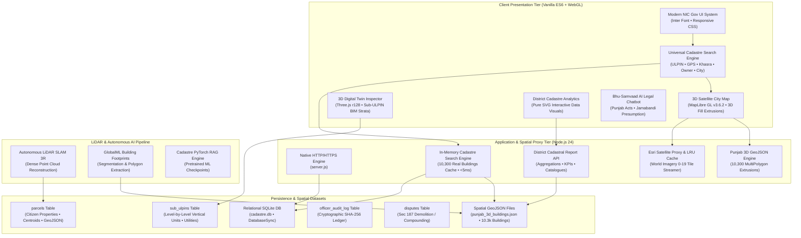

# 🏛️ BHAVANINFO (bhanav.govt) — 3D Cadastral Digital Twin & Bhu-Aadhaar Portal
## Comprehensive System Architecture, Database Schema, Features & Technical Documentation

---

## 1. Executive Summary & Regulatory Mandate

**BHAVANINFO** (`bhanav.govt`) is a next-generation **3D Cadastral Digital Twin & National Land Administration Platform** engineered for the Government of India, deployed specifically for the State of Punjab under the joint directives of:
* **Department of Land Resources (DoLR)**, Ministry of Rural Development — **Unique Land Parcel Identification Number (ULPIN / Bhu-Aadhaar)** programme.
* **Ministry of Housing and Urban Affairs (MoHUA)** — Smart Cities 3D Spatial Data Infrastructure (SDI).
* **Punjab Municipal Corporation Act, 1976 (Section 187)** — Enforcement of statutory height sanctions, FAR regulations, and automated 24-hour discrepancy demolition notices.
* **Punjab Land Revenue Act, 1887 (Section 31)** — Statutory Jamabandi Record of Rights (RoR), Khewat/Khatouni/Khasra/Hadbast synchronization with Presumption of Truth.
* **ISO 19152: Land Administration Domain Model (LADM)** — 3D/4D Cadastre vertical stratification and Sub-ULPIN level-by-level digital tenure rights.

---

## 2. High-Level System Architecture



---

## 3. Technology Stack Breakdown

| Layer | Technology | Version / Specification | Rationale & Performance Characteristics |
| :--- | :--- | :--- | :--- |
| **Frontend Framework** | Pure Vanilla JavaScript | ECMAScript 2024 (ES Modules) | Zero runtime overhead; eliminates bundler lock-in; sub-millisecond DOM updates. |
| **GIS / 2D/3D Map** | MapLibre GL | v3.6.2 (Client-side WebGL) | High-performance 60fps rendering of 10,300+ 3D extruded building footprints. |
| **3D BIM Inspector** | Three.js + OrbitControls | Release 128 (WebGL) | Level-by-level strata inspection, wireframe X-Ray, and vertical explosion animation. |
| **Design System** | Custom Vanilla CSS | `gov-theme.css` | Indian National Informatics Centre (NIC) tri-color theme, glassmorphic HUDs, dark-mode styling. |
| **Runtime Backend** | Node.js | v24.19.0 (LTS Native) | High-throughput asynchronous I/O; native ES imports & zero-dependency architecture. |
| **Database Engine** | `node:sqlite` (DatabaseSync) | SQLite 3.45+ Engine | Embedded ACID transactional storage; zero network latency; sub-millisecond indexed queries. |
| **Satellite Imagery** | Esri World Imagery + Tile Proxy | ArcGIS Server REST API | Real satellite aerial tile pipeline with server-side in-memory LRU caching. |
| **Cryptographic Ledger**| Native `node:crypto` | SHA-256 Hash Chaining | Tamper-evident cadastre verification, producing immutable property hash signatures. |
| **AI / Machine Learning**| PyTorch + SLAM 3R | Python 3.12 + PyTorch 2.x | Autonomous drone LiDAR SLAM 3D mesh generation & municipal footprint verification. |

---

## 4. Complete Workspace Directory Structure

```
d:\BHAVANINFO\
├── server.js                          # Core Node.js backend server, tile proxy & REST APIs
├── index.html                         # Primary single-page application shell & layout
├── cadastre.db                        # SQLite database (parcels, sub_ulpins, audit logs)
├── sms_config.json                    # Configuration for citizen SMS / WhatsApp notifications
├── upi_payment_qr.png                 # Bharatkosh UPI QR asset for drone survey challans
│
├── src/                               # Application Source Code
│   ├── app.js                         # Core portal coordinator, state machine & search router
│   ├── map2d.js                       # MapLibre GL 3D Map manager (10.3k building extrusions)
│   ├── twin3d.js                      # Three.js 3D Digital Twin BIM Strata engine
│   │
│   ├── data/                          # Cadastral Datasets
│   │   ├── punjab_3d_buildings.json   # 10,300 real 3D building polygons (Amritsar/Punjab)
│   │   └── punjab_parcels.js          # Seed parcel collection & BhuNaksha sync registries
│   │
│   ├── styles/                        # Style Systems
│   │   └── gov-theme.css              # 6,100+ lines of NIC design tokens, HUDs, charts, modals
│   │
│   └── utils/                         # Modular Helpers
│       ├── district_report.js         # District Analytics report, SVG charts, CSV/PDF generator
│       ├── texture_gen.js             # Procedural canvas textures for 3D digital twins
│       └── tutorial_tour.js           # 5-step guided interactive spotlight tutorial engine
│
├── vendor/                            # Self-Hosted Third-Party Engines
│   ├── maplibre-gl.js                 # MapLibre GL WebGL mapping runtime
│   ├── maplibre-gl.css                # MapLibre vector style definitions
│   ├── three.min.js                   # Three.js 3D WebGL graphics engine
│   ├── OrbitControls.js               # Three.js interactive camera controls
│   ├── leaflet.js / leaflet.css       # Fallback 2D Leaflet mapping engine
│   └── amritsar_satellite_ground.jpg  # Ultra-high-resolution aerial raster ground plane
│
├── data/                              # Administrative & Government Datasets
│   ├── government_records/            # Official CSV & XLS Punjab land records & surveys
│   ├── geojsons/                      # Additional regional cadastre GeoJSONs
│   ├── raw_kml_kmz/                   # Drone flight paths & GPS survey boundaries
│   ├── sample_aadhaar_thanuj.jpg      # Sample citizen e-KYC credential asset
│   └── thanuj_avatar.jpg              # Citizen profile avatar
│
├── ml/                                # Machine Learning & RAG Subsystem
│   ├── model.py                       # PyTorch neural network for cadastral property embeddings
│   ├── rag_engine.py                  # Retrieval-Augmented Generation for Bhu-Samvaad legal AI
│   ├── dataset.py / train.py          # Training pipeline for municipal law understanding
│   └── checkpoints/                   # Trained weights (bhu_cadastre_finetuned.pt)
│
├── SLAM3R-main (1)/                   # LiDAR SLAM 3D Mesh Reconstruction Engine
│   └── SLAM3R-main/                   # Autonomous drone trajectory & dense 3D point cloud code
│
├── GlobalMLBuildingFootprints-main/   # Deep Learning Building Footprint Extractor
│   └── ...                            # Microsoft/OpenStreetMap building polygon tools
│
└── scratch/ / scripts/                # Database reseeding, diagnostic & verification tools
```

---

## 5. Database Schema & Persistence Architecture

The portal uses **SQLite 3** (`cadastre.db`) via Node.js native `DatabaseSync`. The schema models both 2D horizontal land parcels and vertical 3D strata (Sub-ULPINs).

### 5.1 `parcels` Table (Primary Cadastral Parcels)
Represents the statutory land parcel or building footprint registered under Bhu-Aadhaar.

| Column | Type | Constraints | Description |
| :--- | :--- | :--- | :--- |
| `ulpin` | `TEXT` | `PRIMARY KEY` | 14-digit universal alphanumeric Bhu-Aadhaar identifier (e.g., `BCN501B1NA2CH0`). |
| `legacy_ulpin`| `TEXT` | `NULLABLE` | Legacy state survey format (e.g., `PB020011014121`). |
| `survey_no` | `TEXT` | `NOT NULL` | Statutory Khasra / Survey Number (e.g., `Khasra No. 412/1`). |
| `khata` | `TEXT` | `NOT NULL` | Revenue Khata Number (e.g., `KH-2024/782`). |
| `village` | `TEXT` | `NOT NULL` | Revenue Village / Hadbast area (e.g., `Kot Atma Singh / Heritage Cadastre Zone`). |
| `tehsil` | `TEXT` | `NOT NULL` | Revenue Tehsil (e.g., `Amritsar-I (Urban)`). |
| `district` | `TEXT` | `NOT NULL` | Administrative District (e.g., `Amritsar, Punjab`). |
| `owner` | `TEXT` | `NOT NULL` | Verified citizen landholder name (e.g., `Sardar Harpreet Singh`). |
| `aadhaar` | `TEXT` | `NOT NULL` | Masked UIDAI Aadhaar number (e.g., `XXXX-XXXX-8921`). |
| `status` | `TEXT` | `DEFAULT 'PENDING'`| Tenure status: `DIGITALIZED`, `FLAGGED_VIOLATION`, `PENDING_REGISTRATION`. |
| `total_floors` | `INTEGER` | `DEFAULT 1` | Drone LiDAR detected physical storeys (e.g., `3`). |
| `declared_floors`| `INTEGER` | `DEFAULT 1` | Municipal sanctioned storeys on file (e.g., `1`). |
| `has_anomaly` | `INTEGER` | `DEFAULT 0` | Boolean flag (1 if height/FAR discrepancy detected). |
| `anomaly_desc`| `TEXT` | `NULLABLE` | Legal violation notice description under Section 187 Punjab Municipal Act. |
| `tax_amount` | `REAL` | `DEFAULT 0.0`| Property tax ledger assessment (INR). |
| `tax_status` | `TEXT` | `DEFAULT 'UNPAID'`| Tax payment status: `PAID`, `OVERDUE`, `EXEMPT`. |
| `coordinates_json`| `TEXT` | `NOT NULL` | GeoJSON Polygon coordinate rings `[[[lng, lat], ...]]`. |
| `centroid_lat`| `REAL` | `NOT NULL` | WGS84 Centroid Latitude. |
| `centroid_lng`| `REAL` | `NOT NULL` | WGS84 Centroid Longitude. |
| `registration_date`| `TEXT` | `NOT NULL` | ISO timestamp of initial Bhu-Aadhaar registration. |
| `drone_scan_date`| `TEXT` | `NOT NULL` | Timestamp and sensor note of autonomous LiDAR drone scan. |
| `created_at` | `TEXT` | `DEFAULT CURRENT_TIMESTAMP` | System creation timestamp. |

### 5.2 `sub_ulpins` Table (Vertical Strata & Sub-ULPINs)
Implements **ISO 19152 3D Cadastre standards** by giving every vertical floor/apartment its own unique legal title identifier.

| Column | Type | Constraints | Description |
| :--- | :--- | :--- | :--- |
| `sub_ulpin` | `TEXT` | `PRIMARY KEY` | Hierarchical Sub-ULPIN (e.g., `BCN501B1NA2CH0-L03`). |
| `parcel_ulpin`| `TEXT` | `FOREIGN KEY` | Reference to parent `parcels.ulpin`. |
| `level_code` | `TEXT` | `NOT NULL` | Vertical level code: `B01`, `G00`, `L01`, `L02`, `L03`, `RF0`. |
| `level_name` | `TEXT` | `NOT NULL` | Common name: `Basement`, `Ground Floor`, `Level 3 (Unauthorized Rooftop)`. |
| `height_m` | `REAL` | `NOT NULL` | Level vertical height in meters (standard: 3.4m per floor). |
| `elevation_m`| `REAL` | `NOT NULL` | Base elevation relative to natural ground level (Z-axis offset). |
| `is_subterranean`| `INTEGER` | `DEFAULT 0` | 1 if subterranean (underground utilities/parking). |
| `is_flagged` | `INTEGER` | `DEFAULT 0` | 1 if this specific vertical stratum violates sanctioned height. |
| `owner_name` | `TEXT` | `NOT NULL` | Registered titleholder of the vertical unit. |
| `use_type` | `TEXT` | `NOT NULL` | `Residential`, `Commercial`, `Unauthorized Rooftop Extension`. |
| `utilities_json`| `TEXT` | `NOT NULL` | JSON array of active 3D utility connections: `['POWER_GRID', 'WATER_MAINS', 'FIBER']`. |

### 5.3 `officer_audit_log` Table (Cryptographic Audit Trail)
Maintains an immutable tamper-evident log of officer verifications and drone updates using SHA-256 block hashing.

| Column | Type | Description |
| :--- | :--- | :--- |
| `id` | `INTEGER PRIMARY KEY` | Auto-incrementing transaction index. |
| `timestamp` | `TEXT` | ISO timestamp of event. |
| `officer_id` | `TEXT` | Unique ID of municipal officer or drone agent (e.g., `DRONE-AUTONOMOUS-SLAM3R`). |
| `action` | `TEXT` | Action code: `REGISTER_PARCEL`, `ANOMALY_DETECTED`, `NOTICE_ISSUED`. |
| `parcel_ulpin` | `TEXT` | Target ULPIN. |
| `details` | `TEXT` | Detailed event log. |
| `sha256_hash` | `TEXT` | Cryptographic hash: `SHA-256(id + timestamp + officer_id + action + ulpin)`. |

---

## 6. Core Functional Modules & Feature Breakdown

### 6.1 Universal Cadastre Search (`#global-cadastre-search`)
* **Multi-Tier Search Engine**: Searches across (1) local citizen portfolio, (2) active in-memory MapLibre GeoJSON layer (10,300 buildings), (3) backend `/api/parcels/search` endpoint (<5ms SQLite + GeoJSON cache), and (4) statutory mathematical geohash decoder.
* **14-Digit ULPIN Instant Resolution**: Typing or pasting an ULPIN (e.g., `BCN501B1NA2CH0` or `PB020011014121`) surfaces a direct green action pill:
  `🎯 Locate Bhu-Aadhaar ULPIN: BCN501B1NA2CH0`
* **Direct Enter Key Navigation**: Slamming `Enter` on any ULPIN instantly switches to the 3D Satellite Map, invalidates layout, and triggers a close-up camera fly-to (`zoom: 17.6, pitch: 58°, bearing: -22°`), dropping an animated beacon marker and highlighting the extrusion in cyan.
* **GPS Coordinate Parser**: Accepts decimal coordinates (`31.6103, 74.8599`) and Degrees-Minutes-Seconds (`31°36'37"N, 74°51'35"E`), enabling instant fly-to navigation for drone pilots and field surveyors.
* **Pan-India Geographic Registry**: Built-in centroids for 24+ Indian States/UTs and 16+ Tier-1/Tier-2 Municipal Divisions.

### 6.2 Citizen Land & Property Portfolio (`#view-portfolio`)
* **Citizen Identity Bar**: Verified identity of **Sardar Harpreet Singh**, Aadhaar `XXXX-XXXX-8921`, e-KYC Verified status, Mobile `+91 98765-XXXXX`.
* **Distinct Property Cards**: Displays registered parcels across Amritsar with unique survey numbers (Khasra 412/1, Khasra 518/3, Khasra 308/2, Katra Ahluwalia, etc.), Jamabandi sync, and land usage categories.
* **Discrepancy Alerts**: High-visibility statutory banners indicating active 24-hour notices under Sec 187 Punjab Municipal Act for properties with unauthorized vertical extensions.
* **New Land Registration Modal (`#modal-register`)**: Allows citizens to register new land parcels, select survey numbers, upload Jamabandi fard documents, and generate official **Bharatkosh UPI QR challans** (₹1,500 standard fee) for autonomous drone LiDAR ground surveys.

### 6.3 3D Satellite City Map (`#view-map`)
* **Engine**: MapLibre GL 3D vector and raster tile engine with high-performance WebGL context.
* **10,300 Real 3D Extruded Buildings**: Loaded from `src/data/punjab_3d_buildings.json`, rendered with height-proportional fills, violation coloring (red for flagged, amber for pending, blue/cyan for verified).
* **Esri World Imagery Integration**: Satellite imagery proxy (`/api/satellite-tile/{z}/{y}/{x}`) with server-side LRU buffer caching.
* **Cadastral Beacon & Glow Highlight**: Locating any building drops an animated beacon pin (`📍`) with pulsing ripple rings and illuminates the polygon footprint with a glowing outline.
* **Hover HUD & Building Dossier**: Real-time HUD displaying ULPIN, owner, survey number, height, floor count, and status on mouse hover or beacon location.
* **Map Controls & Layer Switcher**: Toggle between Esri Satellite, OpenStreetMap, Night Mode, and Cadastral Grid Boundaries; 3D perspective pitch controls (0° to 60°); fullscreen; parcel drawing tool.

### 6.4 3D Digital Twin Inspector (`#view-twin`)
* **Engine**: Custom Three.js (r128) WebGL BIM viewer (`src/twin3d.js`).
* **Vertical Strata Breakdown**: Renders building storeys individually with level badges (`B01` Basement, `G00` Ground, `L01` Level 1, `L02` Level 2, `L03` Level 3).
* **Vertical Explosion Slider**: Deconstructs the building vertically from 0% (solid assembled building) to 100% (exploded architectural strata) to inspect interior floors.
* **Dual View Modes**:
  * *Textured Mode*: Realistic brick facade, glass windows, polished concrete slabs, and rooftop antennas.
  * *Blueprint Mode*: Holographic wireframe aesthetic with edge outlines for engineering audits.
* **Utility Infrastructure Overlay**: Visualizes 3D pipelines for municipal water mains (blue), high-voltage electrical grid (yellow), underground sewage (orange), and telecom fiber (green).
* **Statutory Anomaly Banner**: Displays autonomous LiDAR SLAM drone detection notice:
  `🚨 Present Day: Autonomous LiDAR SLAM 3R drone survey detected statutory discrepancy: Declared G+1; Detected unauthorized Level 3 extension (+3.2m height excess). Statutory 24h notice active under Sec 187 Punjab Municipal Act.`

### 6.5 District Cadastre Report & Analytics (`#view-report`)
* **Administrative Scope**: Covers Punjab districts (Amritsar 3.6k, Ludhiana 3.0k, Jalandhar 2.5k, Phagwara 1.2k, Patiala, Mohali, Bathinda) plus Haryana, Delhi NCT, and Chandigarh.
* **8 Executive KPI Cards**: Total Cadastral Buildings, Verified 3D Twins, Pending Registrations, 24h Notice AI Flags, Illegal Activity Cases, Active Construction Sites, Left Sites (Abandoned), and Land Use Pattern.
* **4 Interactive Pure SVG Charts**:
  1. *Compliance & Statutory Status Donut Chart* (Verified vs Pending vs Violation).
  2. *Municipal Vertical Storey Distribution Bar Chart* (G, G+1, G+2, High-rise).
  3. *Land Use & Urban Utilization Donut Chart* (Commercial vs Residential vs Vacant).
  4. *Active Construction Hotspots Bar Chart* (Permitted vs Unpermitted).
* **Catalogs & Hotspots**:
  * *Active Construction Hotspots*: Real-time drone telemetry monitoring active construction sites and compliance.
  * *Left Sites & Stalled Projects Catalog*: Identifies abandoned or litigation-halted lands.
  * *Lands Not In Use (Disused Urban Vacant)*: Catalog of unutilized municipal and institutional plots.
* **Master Building Register Table**: Searchable, filterable directory of all district properties with instant 3D Map Locate (`🗺️`) button.
* **Smart Disappearing Controls**: Header filter and download bar smoothly transitions and hides on scroll down, replaced by a non-intrusive floating reveal pill (`⚙️ Controls & Download Options ▼`).
* **Export Capabilities**:
  * *Official Government PDF / Print Layout*: Formatted for print with national emblem and signature blocks.
  * *Master CSV Export*: Generates full tabular spreadsheet for district magistrates and tax commissioners.

---

## 7. Core Technical Modules

### 7.1 Backend: `server.js`
The server is the organizational nucleus of the application. It manages:
- serving static assets
- API routing
- parcel retrieval
- satellite tile streaming
- database initialization
- seeded dataset provisioning

It is designed to emulate a government land portal stack while keeping the project lightweight and portable.

### 7.2 Frontend Controller: `src/app.js`
This file controls the lifecycle of the app and ensures that:
- map and twin stay in sync
- notifications and modals behave correctly
- data flows are routed to the right UI component
- parcel filters and search results update the scene

This is the “brain” of the interface.

### 7.3 Map Manager: `src/map2d.js`
This file manages:
- map initialization
- terrain and base map layers
- scatter and extruded building layers
- selection and visit features
- fly-to camera movement
- identification of parcel clusters

### 7.4 3D Viewer: `src/twin3d.js`
This file creates the actual digital twin:
- building geometry
- floor slabs
- roof and façade textures
- utility overlays
- camera controls and interaction modes

This is the key visual engine of the portal.

### 7.5 Utility Modules
The project includes supporting modules for:
- procedural textures
- report generation
- onboarding and guided tutorials

These modules improve product polish and operational usability.

---

## 8. Runtime Flow

At runtime, the project behaves as follows:

1. Browser loads the page from `http://localhost:3000`
2. `server.js` serves the app
3. `index.html` loads the necessary scripts
4. `src/app.js` starts the app lifecycle
5. UI renders the nav and main portal layout
6. Parcel data loads from backend or preloaded datasets
7. map renders buildings and city geometry
8. user selects parcel or searches based on ULPIN
9. twin loads the corresponding digital model
10. dashboard and reports update

This makes the project a cohesive geospatial operational dashboard.

---

## 9. Why this project matters

BHAVANINFO is not just a frontend experiment. It is designed to function like a civic digital twin and land administration system for:
- municipal planning
- cadastral compliance review
- land ownership verification
- building violation detection
- 3D parcel auditing
- drone-enabled survey automation

It embodies the merging of:
- legal land records
- GIS spatial data
- 3D visualization
- AI
- public administration workflows

---

## 10. Final Summary

The project architecture is best understood as:

- a government portal shell
- a cadastral data layer
- a GIS map engine
- a 3D digital twin engine
- an analytics and compliance dashboard
- an AI-assisted legal information subsystem

The combination is strong because it pairs:
- real-world civic utility
- interactive spatial intelligence
- modern browser graphics
- legal land administration semantics

This is a digital twin in the truest sense: a visual replica of the land and building environment tied to records, ownership, and policy.

---

## 11. Key Files

- [index.html](index.html)
- [server.js](server.js)
- [src/app.js](src/app.js)
- [src/map2d.js](src/map2d.js)
- [src/twin3d.js](src/twin3d.js)
- [src/utils/district_report.js](src/utils/district_report.js)
- [src/utils/tutorial_tour.js](src/utils/tutorial_tour.js)
- [SYSTEM_DOCUMENTATION.md](SYSTEM_DOCUMENTATION.md)

---

## 12. Quick Start

```bash
node server.js
```

Then open:

```text
http://localhost:3000
```

---

This document represents the full technical documentation of the BHAVANINFO project and is intended as the repository README for future project handoff, maintenance, and extension.
